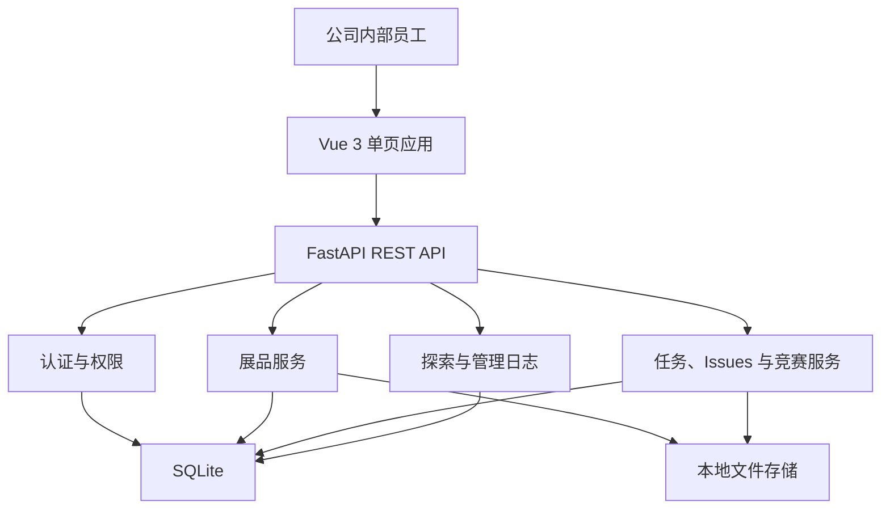

# MkAIHub 项目规划

> 文档状态：规划基线
> 版本：v1.0
> 更新日期：2026-08-26
> 适用范围：MkAIHub 公司内部 AI 分享平台

## 1. 文档目的

本文档用于统一 MkAIHub 的项目定位、产品边界、核心概念、总体技术路线、建设阶段和未来演进方向。

本文档描述的是相对稳定的项目基线；首版的页面、表结构、接口和研发批次见 [MkAIHub 首版实现方案](./MkAIHub首版实现方案.md)，当前 Python 主线的任务、展品、竞赛闭环建设见 [MkAIHub 第二阶段闭环实施方案](./MkAIHub第二阶段闭环实施方案.md)。

## 2. 项目定位

MkAIHub 是面向公司内部员工的轻量级 AI 分享平台，用于集中展示、沉淀和复用公司内部的 AI 实践成果，并为任务、知识、议题和竞赛保留可持续扩展的模块骨架。

平台优先解决以下问题：

- AI 使用经验、提示词、代码、工作流和报告分散在个人电脑或聊天记录中，难以检索和复用。
- 员工遇到 AI 相关需求时缺少统一的任务发布和查看入口。
- 任务、知识、议题和竞赛信息缺少统一的平台入口。
- 缺少简单、可控、可审计的内部分享渠道。

MkAIHub 不是公开互联网社区，不承担公开用户增长、商业交易、奖金结算和开放生态运营职责。

## 3. 建设目标

### 3.1 首要目标

1. 让员工能够快速发布、查找和复用 AI 分享内容。
2. 搭建探索、任务、展品、知识库、Issues 和竞赛六个模块骨架。
3. 优先完整实现展品的发布、附件、检索和交流能力。
4. 通过统一内容结构、文件和权限管理降低维护成本。
5. 保持部署简单，首版可以在单台内部服务器上运行。

### 3.2 非目标

首版不建设以下能力：

- 面向公众的注册、组织入驻和社区运营。
- 支付、奖金托管、提现和财务结算。
- Toolkits、Data Lab、MapOS。
- AI Agent 自动接取和执行任务。
- 竞赛报名、组队、作品提交、评审、排行榜和自动评测。
- 独立知识数据模型、RAG 知识库和复杂智能问答。
- 任务参与、成果提交、验收和成果转展品流程。
- 微服务、消息总线和多节点高可用架构。
- 实时聊天、音视频会议和在线协同编辑。

## 4. 使用对象与角色

### 4.1 普通员工

- 浏览和搜索内部 AI 分享。
- 创建、编辑和发布自己的分享。
- 发布和维护自己的任务。
- 发起 Issues，并对展品或 Issues 发表评论。
- 在各模块中筛选自己创建的内容。

### 4.2 系统管理员

- 具备普通员工的业务权限。
- 创建、停用和维护内部账号。
- 分配角色。
- 管理竞赛及其他平台内容。
- 归档或恢复异常展品，关闭异常任务，关闭或重开 Issues。
- 隐藏或恢复不合适的评论。
- 查看内容和文件基本信息。
- 查看系统状态和服务器日志。
- 执行备份、恢复和基础系统配置。

首版只有 `EMPLOYEE` 和 `SYSTEM_ADMIN` 两种角色，不设置内容管理员等中间管理角色，也不引入复杂组织树。普通员工可以同时是展品作者、任务发布人和 Issue 发起人，系统管理员统一承担平台管理职责。

## 5. 产品信息架构

首版使用以下一级导航：

```text
探索 / 任务 / 展品 / 知识库 / Issues / 竞赛
```

### 5.1 探索

探索是登录后的轻量聚合页，不建立独立数据表：

- 六个一级模块的固定入口。
- 最近发布的 6 条展品。

首版不展示热门排行，也不聚合任务、Issues 和竞赛数据。

### 5.2 展品

展品是首版核心模块，统一承载经验、提示词、工具、代码、文档和资料等公司内部 AI 分享内容。

首版不设置展品类型、分类或标签，不增加相关字段、数据表和管理页面。内容查找只使用标题、摘要和正文关键词；后续只有在实际内容量证明不足时，再评估增加结构化分类能力。

### 5.3 任务

- 任务列表、详情、创建和编辑。
- 创建后直接开放，支持开放、完成和关闭状态。
- 首版不实现参与、提交和验收链路。

### 5.4 知识库

- 原型中的知识库是独立的文档与问答模块，与展品类型没有直接依赖关系。
- 保留独立导航和占位页面，完成模块骨架。
- 首版不建立知识表、列表、详情或 API，也不复制展品数据。
- 页面说明该能力将在知识管理需求明确后建设。
- 首版暂缓知识库是为了控制实施范围，而不是因为展品取消了类型；后续可独立设计知识模型，或在业务确认后建立与展品的显式关联。

### 5.5 Issues

- Issue 列表、详情、发起、评论、开放和关闭。
- 用于收集产品建议、问题和内部讨论议题。

### 5.6 竞赛

- 竞赛列表、详情和管理员维护。
- 首版只展示基本介绍、时间、状态和规则。
- 不实现报名、组队、提交、评审和排行榜。

### 5.7 个人内容筛选

- 不建设独立工作台和对应路由。
- 展品、任务和 Issues 列表提供“只看我的”开关。

### 5.8 最小管理页

- 仅提供一个 `/admin` 页面。
- 页面使用用户、内容、竞赛三个页签。
- 用户页签用于创建、停用、重置账号和设置角色。
- 内容页签用于处理展品、任务、Issues 和评论。
- 竞赛页签用于维护竞赛。
- 不建设标签、文件信息和审计日志独立页面。

## 6. 核心业务原则

### 6.1 展品直接发布

平台属于公司内部系统。普通员工可以直接发布自己的展品，不增加发布前审批环节。系统管理员保留归档和下架权限。

展品状态保持简单：

```text
草稿 -> 已发布 -> 已归档
```

### 6.2 模块骨架优先

首版为六个一级模块提供真实路由，但不要求每个模块都具备完整业务闭环。知识库只提供占位页面，探索和竞赛使用最小实现，避免为骨架提前增加复杂数据模型。

首版遵循最小实现原则：不增加尚未证明必要的类型、分类和标签；能通过现有数据解决的，不增加新表；能通过列表筛选解决的，不增加独立工作台；没有明确首版用途的字段、状态、统计和后台页面暂不实现。

### 6.3 不处理真实奖励

原型中的奖金和价格字段不进入首版。未来如需激励，可引入非财务性质的贡献积分、徽章或内部认可机制。

### 6.4 权限由后端强制执行

前端隐藏按钮不构成权限控制。资源归属、角色权限和状态切换必须由 FastAPI 后端校验。

## 7. 总体技术路线

### 7.1 技术栈

| 层次 | 选型 | 说明 |
|---|---|---|
| 前端 | Vue 3 + TypeScript | 组件化单页应用 |
| 构建 | Vite | 开发服务器和生产构建 |
| Node.js | 使用系统安装版本 | 当前开发环境基线为 v24.15.0，不引入额外版本管理器 |
| 前端包管理 | npm | 使用 `package-lock.json` 锁定依赖 |
| 路由 | Vue Router | 页面和权限路由 |
| 状态 | Pinia | 仅保存用户、权限等少量全局状态 |
| 组件库 | Element Plus | 表单、表格、上传、弹窗和后台页面 |
| 样式 | CSS Variables + Scoped CSS | 保留现有原型视觉语言 |
| 后端 | Python 3.13 + FastAPI | REST API、权限和业务服务 |
| Python 工程管理 | uv | Python 版本、虚拟环境、依赖和锁文件管理 |
| ORM | SQLAlchemy | 数据访问和事务管理 |
| 迁移 | Alembic | 数据库结构版本管理 |
| 数据库 | SQLite | 首版单机、低写入并发场景 |
| 文件 | 本地文件目录 | 数据库仅保存文件元数据 |
| 版本控制 | Git | 源码、文档、迁移和锁文件版本管理 |
| 部署 | Linux + Docker Compose | 单应用容器和本地持久化目录 |
| 测试 | Pytest + Vitest + Playwright | 后端、前端和核心流程测试 |

技术参考：

- [Vue 官方文档](https://vuejs.org/)
- [FastAPI 官方文档](https://fastapi.tiangolo.com/)
- [uv 官方文档](https://docs.astral.sh/uv/)
- [SQLAlchemy 官方文档](https://docs.sqlalchemy.org/)
- [Alembic 官方文档](https://alembic.sqlalchemy.org/)
- [Element Plus 官方文档](https://element-plus.org/)
- [SQLite 官方文档](https://sqlite.org/docs.html)
- [Git 官方文档](https://git-scm.com/doc)

### 7.2 架构形态

首版采用模块化单体和单机部署，不拆微服务。



后端内部保持简单分层：

```text
API 路由 -> 业务服务 -> SQLAlchemy 模型
```

首版不增加 Repository、领域事件、CQRS、消息队列等额外抽象。

正式环境部署在 Linux 服务器，通过 Docker Compose 管理单个应用服务。Vue 生产构建由 FastAPI 统一托管；SQLite 数据库和上传文件通过宿主机本地目录持久化，不保存在容器临时文件系统中。

### 7.3 uv 与 Git 基线

Python 后端使用 uv 管理项目环境：

- Python 大版本固定为 3.13。
- `pyproject.toml` 使用 `requires-python = ">=3.13,<3.14"`，避免环境漂移到其他大版本。
- 依赖声明以 `pyproject.toml` 为准。
- `uv.lock` 记录精确解析版本并提交到 Git。
- 本地开发使用 `uv sync` 建立环境，使用 `uv run` 执行后端、迁移和测试命令。
- 自动化检查和部署使用锁文件模式，避免未声明的依赖升级。
- `.venv` 不提交到 Git，`requirements.txt` 不作为首版的主依赖源。

前端直接使用系统安装的 Node.js 和 npm。当前开发环境检测结果为 Node.js v24.15.0、npm 11.12.1；该信息作为当前兼容性基线，不新增 `.nvmrc`、Volta 或其他 Node.js 版本管理工具。工程初始化和构建前应输出实际 `node --version` 与 `npm --version`，如果未来系统版本发生变化，应先完成 `npm ci`、类型检查、测试和生产构建验证。

项目使用一个 Git 仓库统一管理前端、后端、文档、数据库迁移和部署配置：

- `main` 保存可运行的集成基线。
- 功能开发使用短生命周期分支，完成验证后合并。
- `uv.lock`、`package-lock.json`、Alembic 迁移和项目文档必须提交。
- `.env`、`.venv`、`node_modules`、构建产物、SQLite 业务数据和上传文件不得提交。
- 提交按功能范围组织，避免将无关格式化或运行数据混入同一提交。

## 8. 认证与权限规划

### 8.1 首版认证

- 不开放自主注册。
- 系统管理员创建员工账号。
- 只提供用户名和密码登录、退出、用户自行修改密码以及管理员重置密码。
- 不提供验证码、忘记密码、首次强制改密、SSO 和多因素认证。
- 使用服务端会话和 HttpOnly Cookie。
- 生产环境 Cookie 开启 `Secure`，并设置合适的 `SameSite` 策略。
- 前端不在 `localStorage` 或 `sessionStorage` 保存访问令牌。
- 对已登录用户的修改请求执行简单 CSRF 防护；首版不增加来源策略、设备/IP 风控或会话管理页面。

### 8.2 后续认证

当公司具备统一身份认证条件时，通过独立适配层接入 LDAP、OIDC 或公司 SSO。业务表只关联平台用户，不直接依赖某一种认证协议。

## 9. 数据与文件原则

### 9.1 SQLite 使用边界

- SQLite 文件与 FastAPI 部署在同一台机器。
- 数据库文件放在本地磁盘，不放在 SMB、NAS、NFS 等网络共享目录。
- 开启 WAL、外键约束和合理的锁等待时间。
- 首版使用单个 FastAPI 应用实例。
- 使用 SQLAlchemy 和 Alembic 管理结构，减少未来迁移 PostgreSQL 的成本。

### 9.2 文件存储

- 文件内容不写入 SQLite BLOB。
- 实际文件存放在受控上传目录。
- 数据库保存原始名称、存储名称、相对路径、大小、MIME、哈希和上传人。
- 下载必须经过后端权限检查。
- HTML、脚本和可执行文件不允许直接在浏览器中执行。
- 单文件最大 50 MB，每条展品最多关联 10 个附件。
- 首版允许文档、图片、代码、Notebook、配置文本和 ZIP，具体扩展名以首版实现方案为准。
- EXE、BAT、CMD、PS1、SH、HTML 等可执行或高风险文件禁止上传。
- 所有附件通过下载响应交付，不由平台直接执行。

### 9.3 备份

一次完整备份应同时包含：

- SQLite 一致性备份文件。
- 上传文件目录。
- 当前环境配置清单，但不包含明文密码和密钥。
- 应用版本和 Alembic 版本信息。

必须在首版交付前完成一次实际恢复验证。

## 10. 非功能性要求

### 10.1 安全

- 密码使用安全的单向密码哈希算法保存。
- 密码规则只校验 8–128 位，不引入复杂度、历史密码或定期更换策略。
- 首版不建设登录限流、设备/IP 风控、会话管理页面或复杂管理员治理。
- 上传文件校验大小和扩展名，并记录客户端声明的 MIME；首版不做内容扫描或深度类型识别。
- 文件路径由服务器生成，不使用用户文件名拼接路径。
- 所有写操作进行身份、资源归属和状态校验。
- 管理操作记录到后端结构化服务器日志，首版不建设独立审计表和查询页面。
- API 错误不返回堆栈、数据库路径或服务器敏感信息。

### 10.2 可维护性

- 使用类型明确的 Pydantic Schema 和 TypeScript 类型。
- 数据库结构变更必须通过 Alembic 迁移。
- 核心状态机集中在服务层，不能散落在路由和前端组件中。
- 配置通过环境变量管理，并提供不含敏感值的 `.env.example`。

### 10.3 可用性

- 支持公司常用桌面浏览器。
- 关键表单提供明确校验和错误提示。
- 列表提供分页、状态、关键词和“只看我的”筛选；不同模块只实现实际需要的筛选项。
- 页面刷新后不能丢失已持久化数据。

## 11. 原型迁移原则

现有 [prototype](../prototype/) 仅作为视觉和信息结构参考，不直接作为生产代码继续扩展。

迁移规则：

- HTML 页面拆分为 Vue 页面和可复用组件。
- `data.js` 中的模拟数据替换为 FastAPI API。
- `app.js` 中的字符串模板和事件绑定替换为 Vue 响应式组件。
- `style.css` 提取颜色、字号、间距、阴影、圆角等设计变量，按组件重新组织。
- 门户卡片和详情页保留自定义视觉。
- 表单、表格、上传、分页、弹窗优先使用 Element Plus。
- 原型中的探索、任务、展品、知识库、Issues 和竞赛页面进入首版路由。
- 探索只展示模块入口和最新展品，知识库只保留占位页，竞赛不实现报名和评审链路。
- arch.os 不进入首版路由。

## 12. 建设阶段

### 12.0 当前阶段

- M0 工程准备和 M1 首版 MVP 已按简化范围完成，Python 版是后续产品能力建设的主线。
- C# 版已经完成首版能力对齐，但第二阶段暂缓同步；待 Python 版闭环稳定后再单独评估是否继续移植。
- M2 批次 7–11 已完成并通过验收：任务、展品、竞赛主链路已经打通，个人待办、闭环统计、跨模块来源筛选、多账号浏览器流程、迁移升级和备份恢复均已完成。
- 批次 12 已完成 M2 文档封板与后续规划；下一步批次 13 先统一批次 8–11 新增前端页面的视觉层级、公共样式、表单操作区和响应式表现，不改变业务逻辑或 API 契约。
- 检索与复用增强顺延到前端体验统一之后；SSO、基础设施扩容和 AI 能力仍按实际反馈与触发条件评估，不与批次 13 同时展开。

### 12.1 M0：规划与工程准备

- 固化产品范围和核心术语。
- 完成首版实现方案。
- 建立前后端工程和开发规范。
- 初始化 Git 仓库、忽略规则和基础分支约定。
- 使用 uv 初始化 Python 工程并生成依赖锁文件。

### 12.2 M1：首版 MVP

- 内部账号和权限。
- 轻量探索页。
- 展品完整发布与交流能力。
- 任务基础 CRUD 和状态骨架。
- 知识库占位页面。
- Issues 基础 CRUD、评论和状态。
- 竞赛列表、详情和管理骨架。
- 各列表的“只看我的”筛选。
- 单页签式最小管理页。
- 单机部署、备份和恢复。

### 12.3 M2：内部使用增强

按以下优先级实施：

1. 任务参与、成果提交、退回修改、验收和展品沉淀。
2. 竞赛任务配置、报名、任务成果评分、结果汇总发布和排行榜。
3. 展品来源展示、个人待办、管理入口和必要的状态通知。
4. 核心闭环的浏览器验收、权限回归、迁移和备份恢复验证。
5. 闭环稳定后，先统一后续新增页面的视觉与交互体验，再根据内部使用反馈评估全文检索、分享版本、内容统计、文件预览和公司 SSO。

详细范围、问题定义、建议数据关系和研发批次见 [MkAIHub 第二阶段闭环实施方案](./MkAIHub第二阶段闭环实施方案.md)。

### 12.4 M3：规模化准备

仅在实际使用压力或运维要求出现后实施：

- SQLite 迁移 PostgreSQL。
- 本地文件迁移 MinIO 或对象存储。
- Redis 和后台任务队列。
- 多实例部署和反向代理。
- 自动文件扫描、缩略图和异步预览。

### 12.5 M4：AI 能力扩展

在内容和使用数据已经稳定后再评估：

- AI 自动摘要、分类和标签建议。
- 企业内部语义检索和 RAG 问答。
- 任务成果自动检查或辅助评审。
- Agent、MCP 和工具调用目录。
- Toolkits、Data Lab、MapOS 等独立能力。

## 13. 演进触发条件

未来升级应由实际问题触发，而不是预先堆叠组件。

### 13.1 升级 PostgreSQL

- 需要运行多个 FastAPI 实例。
- 出现持续的并发写入和数据库锁等待。
- 后台任务、集成程序和用户请求同时频繁写入。
- 需要高可用、时间点恢复或更完善的数据库运维能力。

### 13.2 引入对象存储

- 上传文件量明显增长。
- 需要多实例共享文件。
- 需要文件生命周期、版本、跨服务器访问或独立备份策略。

### 13.3 引入任务队列

- 出现耗时的 AI 调用、文件解析、预览生成或批量通知。
- 请求无法在普通 HTTP 响应时间内可靠完成。

## 14. 已确认决策

| 决策项 | 当前结论 |
|---|---|
| 平台性质 | 公司内部轻量级 AI 分享平台 |
| 系统显示名称 | MkAIHub |
| 前端 | Vue 3 + TypeScript + Vite |
| Node.js | 使用系统版本；当前基线 v24.15.0 |
| 前端包管理 | npm，提交 `package-lock.json` |
| 前端组件 | Element Plus + 自定义门户组件 |
| 后端 | Python 3.13 + FastAPI |
| Python 工程管理 | uv，提交 `uv.lock` |
| 数据库 | SQLite 首版，保留 PostgreSQL 迁移能力 |
| 文件 | 首版本地存储 |
| 版本控制 | 单一 Git 仓库管理源码、文档和迁移 |
| 架构 | 模块化单体、单机部署 |
| 正式部署 | Linux 服务器 + Docker Compose |
| 用户认证 | 管理员创建账号；基础用户名密码登录；不做注册、验证码、找回密码、首次强制改密、SSO 和 MFA |
| 角色模型 | 普通员工 `EMPLOYEE`、系统管理员 `SYSTEM_ADMIN`；不设置其他管理员角色 |
| 一级导航 | 探索、任务、展品、知识库、Issues、竞赛 |
| 首版模块深度 | 展品为核心；探索轻量；任务/Issues/竞赛搭建基础骨架；知识库仅占位 |
| 内容发布 | 员工直接发布展品，系统管理员可归档或下架 |
| 展品可见性 | 所有已发布展品对全部登录员工可见，不做指定人员或部门范围 |
| 评论规则 | 登录员工直接发布；本人可删除；系统管理员可隐藏或恢复 |
| 展品类型 | 首版不设置 |
| 分类和标签 | 首版均不实现，仅提供关键词检索 |
| 上传限制 | 单文件 50 MB，每条展品最多 10 个附件 |
| 任务协作 | 首版不做参与、提交和验收，放入后续阶段 |
| 商业能力 | 不做支付和奖金结算 |
| 探索页 | 六个模块入口 + 最近发布的 6 条展品 |
| 个人内容 | 不做工作台，各模块列表使用“只看我的” |
| 品牌 | 首版只显示文字名称 `MkAIHub`，不设计 Logo 和宣传语 |
| 当前开发主线 | 优先完善 Python 版；C# 版第二阶段暂缓同步 |
| 第二阶段目标 | 先完成任务、展品、竞赛闭环，再安排其他 M2 增强能力 |
| M2 验收结论 | 批次 7–11 已完成；任务、竞赛、展品核心闭环、多账号浏览器流程、迁移及备份恢复均通过验收 |
| 下一批次 | 批次 13 优先统一批次 8–11 新增前端页面的样式和交互体验，不修改业务规则与 API 契约 |
| 成果载体 | 展品继续作为全部任务成果的统一内容载体，不复制正文和附件 |
| 任务归属 | 保留普通独立任务；竞赛可以包含多个任务，一项任务最多属于一个竞赛 |
| 竞赛任务 | 配置必做/选做、排序、最高分和权重，通过任务提交关联展品 |
| 竞赛计分 | 每项任务允许多轮提交，只取最终有效版本评分并按权重汇总 |

## 15. 第二阶段启动前需确认（已确认）

以下业务规则已于 2026-08-24 确认：

1. 任务参与为员工直接领取，任务发布人无需逐个审批。
2. 任务成果和竞赛作品在提交时必须已经发布，不引入受限可见状态。
3. 普通独立任务允许多人分别参与和提交，发布人可以选择一个或多个成果验收。
4. 竞赛首期由系统管理员直接评审，不单独配置评委、评分项和权重。

完整的状态机、权限矩阵、数据契约和接口契约见 [MkAIHub 第二阶段批次7数据契约](./MkAIHub第二阶段批次7数据契约.md)。

## 16. 相关文档

- [MkAIHub 首版实现方案](./MkAIHub首版实现方案.md)
- [MkAIHub 第二阶段闭环实施方案](./MkAIHub第二阶段闭环实施方案.md)
- [MkAIHub 第二阶段批次7数据契约](./MkAIHub第二阶段批次7数据契约.md)
- [MkAIHub 第二阶段批次11验收记录](./MkAIHub第二阶段批次11验收记录.md)
- [MkAIHub 后续增强实施方案](./MkAIHub后续增强实施方案.md)
- [现有静态原型](../prototype/index.html)
